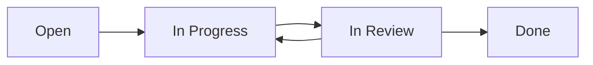

# Jira Project Management Guide

## Introduction
Jira is a powerful project management tool developed by Atlassian, primarily used for issue tracking and agile project management. This guide covers essential features and best practices for using Jira effectively.

## Core Concepts

### Issues
- Basic unit of work in Jira
- Represents tasks, bugs, stories, epics
- Contains metadata, descriptions, attachments
- Trackable through workflow states

### Issue Types
1. **Story**
   - User-centric feature descriptions
   - Contains acceptance criteria
   - Estimated in story points

2. **Bug**
   - Software defects
   - Includes steps to reproduce
   - Priority and severity levels

3. **Epic**
   - Large body of work
   - Contains multiple stories
   - Spans multiple sprints

4. **Task**
   - General work items
   - Technical tasks
   - Documentation work

### Fields and Properties
```
Summary: Brief description
Description: Detailed explanation
Assignee: Responsible person
Reporter: Issue creator
Priority: Importance level
Status: Current state
Components: System parts affected
Labels: Categorization tags
```

## Agile Project Management

### Scrum Board
1. **Columns**
   - Backlog
   - To Do
   - In Progress
   - In Review
   - Done

2. **Features**
   - Drag-and-drop functionality
   - Swimlanes for categorization
   - Quick filters
   - Card customization

### Kanban Board
1. **Setup**
   - Continuous flow
   - WIP limits
   - Cycle time tracking
   - Cumulative flow diagram

2. **Management**
   - Real-time updates
   - Team capacity tracking
   - Bottleneck identification
   - Process optimization

## Sprint Management

### Sprint Planning
```
1. Create Sprint
2. Set Sprint Goal
3. Estimate Stories
4. Add Issues to Sprint
5. Start Sprint
```

### During Sprint
- Daily standups
- Issue updates
- Impediment tracking
- Burndown monitoring

### Sprint Closure
- Review completion
- Update velocities
- Retrospective notes
- Sprint reports

## Workflows

### Basic Workflow


### Custom Workflow Creation
1. **Status Creation**
   - Define states
   - Set category
   - Configure properties

2. **Transition Configuration**
   - Define conditions
   - Set validators
   - Add post functions

## Reporting and Metrics

### Agile Reports
1. **Sprint Reports**
   - Completion rate
   - Scope changes
   - Burndown chart
   - Velocity tracking

2. **Backlog Reports**
   - Epic burndown
   - Version report
   - Cumulative flow
   - Control chart

### Custom Dashboards
```
Components:
- Assigned Issues
- Sprint Health
- Release Progress
- Team Workload
- Issue Statistics
```

## JQL (Jira Query Language)

### Basic Syntax
```sql
project = "ProjectName" 
AND status = "In Progress" 
AND assignee = currentUser()
ORDER BY priority DESC
```

### Common Queries
```sql
-- Find my open issues
assignee = currentUser() AND resolution = Unresolved

-- Sprint backlog
sprint in openSprints() AND type = Story

-- Recent updates
updated >= -7d ORDER BY updated DESC

-- High priority bugs
type = Bug AND priority in (Highest, High)
```

## Integration Features

### Development Tools
1. **Git Integration**
   - Branch creation
   - Commit linking
   - Pull request tracking
   - Build status

2. **CI/CD Pipeline**
   - Build information
   - Deployment status
   - Release tracking
   - Environment details

### Communication Tools
```
Slack Integration:
- Issue notifications
- Command integration
- Channel updates
- Status changes
```

## Administration

### Project Settings
1. **Configuration**
   - Issue types
   - Workflows
   - Screens
   - Field configurations

2. **Permissions**
   - User roles
   - Group access
   - Project roles
   - Issue security

### User Management
```
Tasks:
- User creation
- Group assignment
- Permission schemes
- Access levels
```

## Best Practices

### Issue Creation
1. **Quality Guidelines**
   - Clear titles
   - Detailed descriptions
   - Proper categorization
   - Relevant attachments

2. **Estimation**
   - Consistent scale
   - Team agreement
   - Historical reference
   - Regular refinement

### Board Management
1. **Organization**
   - Regular cleanup
   - WIP limits
   - Column policies
   - Filter utilization

2. **Workflow**
   - Status clarity
   - Transition rules
   - Automation usage
   - Process compliance

## Troubleshooting

### Common Issues
1. **Performance**
   - Clear filters
   - Optimize dashboards
   - Clean old issues
   - Archive completed sprints

2. **Access Problems**
   - Check permissions
   - Verify group membership
   - Review project roles
   - Validate licenses

## Additional Resources
- [Atlassian Documentation](https://support.atlassian.com/jira-software-cloud/)
- [Jira Agile Tutorial](https://www.atlassian.com/agile/tutorials)
- [Community Forums](https://community.atlassian.com/)
- [Training Resources](https://training.atlassian.com/)
